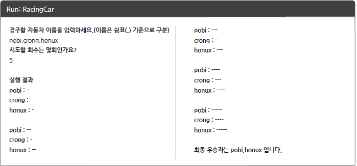

# 자동차 경주 게임

## 기능 요구사항
- 주어진 횟수 동안 n대의 자동차는 전진 또는 멈출 수 있다. 
- 각 자동차에 이름을 부여할 수 있다. 전진하는 자동차를 출력할 때 자동차 이름을 같이 출력한다. 
- 자동차 이름은 쉼표(`,`)를 기준으로 구분하며 이름은 5자 이하만 가능하다. 
- 사용자는 몇 번의 이동을 할 것인지를 입력할 수 있어야 한다. 
- 전진하는 조건은 0에서 9 사이에서 random 값을 구한 후 random 값이 4 이상일 경우 전진하고, 3 이 하의 값이면 멈춘다. 
- 자동차 경주 게임을 완료한 후 누가 우승했는지를 알려준다.  
- 우승자가 한 명 이상일 경우, 쉼표(`,`)로 이름을 구분해 출력한다. 
- 사용자가 잘못된 값을 입력할 경우 `[ERROR]`로 시작하는 에러 메시지를 출력 후 입력을 다시 받는다.

## 프로그램 실행 결과

## 개발 요구사항
- src/main/java 폴더의 racinggame.Application의 main()메서드로 시작해야 한다.
- JDK 8에서 실행이 가능해야한다.
- Random, Scanner API는 nextstep.utils패키지의 Randoms, Console API를 활용해야 한다.
- src/test/java폴더의 racinggame.Application의 2개의 Test Case를 모두 통과해야 한다.
- 자바 코드 컨벤션을 지켜야 한다.
- indent(들여쓰기)는 2를 넘지 않도록 구현한다.(1까지만 가능하다) 
- Stream API를 사용해선 안된다. 
- else 예약어를 쓰지 말아야 한다. 
- 함수의 길이는 10라인을 넘지 않도록 구현한다.
- 일급 콜렉션을 활용해 구현한다.
- 모든 원시값과 문자열을 포장한다.
- 모든 도메인 로직에는 단위 테스트를 구현해야 한다. 

## 구현해야 하는 기능 상세
- 주어진 횟수 동안 n대의 자동차는 전진 또는 멈출 수 있다.
  - 주어진 횟수 동안 n대의 자동차에게 전진 명령을 전달 하는 기능: notifyCars()
  - 자동차를 이동 전략에 따라 전진 혹은 멈추게 하는 기능: move(MoveStrategy strategy)

- 각 자동차에 이름을 부여할 수 있다. 전진하는 자동차를 출력할 때 자동차 이름을 같이 출력한다.
  - 자동차는 name 필드를 가진다. constructor or static method 
  - 자동차의 이름 출력 기능: toString()
  
- 자동차 이름은 쉼표(`,`)를 기준으로 구분하며 이름은 5자 이하만 가능하다.
  - 구분자(delimiter)로 문자열을 구분하는 기능: split(str)
  - 분리한 문자열의 유효성을 검사하는 기능: validateCarName();
  
- 사용자는 몇 번의 이동을 할 것인지를 입력할 수 있어야 한다.
  - requestGameRound()
  
- 전진하는 조건은 0에서 9 사이에서 random 값을 구한 후 random 값이 4 이상일 경우 전진하고, 3 이 하의 값이면 멈춘다.
  - RandomMoveStrategy()
  
- 자동차 경주 게임을 완료한 후 누가 우승 했는지를 알려준다.
  - getWinners()
  
- 우승자가 한 명 이상일 경우, 쉼표(`,`)로 이름을 구분해 출력한다.
  - 우승자를 순회하며 StringBuilder의 append 메서드를 이용한다. 
  
- 사용자가 잘못된 값을 입력할 경우 `[ERROR]`로 시작하는 에러 메시지를 출력 후 입력을 다시 받는다.
  - catch에서 예외를 받을 경우 출력문의 접두사에 `[ERROR]` 을 붙히도록 한다. 

## 자동차 게임 구조
### config
- CarRacingConfig : 자동차 경주 게임에 필요한 클래스의 의존관계 설정 클래스

### Application
- CarRacingService : 자동차 경주 게임 서비스 로직을 구현하는 클래스

### Controller
- CarRacingController: 자동차 게임에 대한 사용자의 요청을 처리하는 클래스

### Domain
- Car : 경주에 참가하는 자동차 클래스
- Cars : 자동차 클래스에 대한 일급 컬렉션
- Name: 자동차의 이름 원시 값의 Wrapper 클래스
- Distance: 자동차가 이동한 거리에 대한 Wrapper 클래스

### DTO
- CarData: 경주에 참가한 자동차의 현재 상태를 저장해 노출하는 자동차 응답 객체
- CarRacingProgress: 자동차 응답 객체 목록을 관리하는 일급 컬렉션으로 기록 시점의 자동차 경주 진행율을 의미한다.
- CarRacingProgressList : 자동차 경주 진행율 목록을 저장하는 일급 컬렉션

### View
- View: 입/출력을 제공하는 인터페이스, InputView,OutPutView를 다중 상속한다.
- OutPutView: 출력 기능을 제공하는 인터페이스
- InPutView: 입력 기능을 제공하는 인터페이스
- CarRacingInputView: 자동차 경주 입력 기능 구현체
- CarRacingProxyInputView: 자동차 경주 입력 기능 프록시 구현체
- CarRacingOutPutView: 자동차 경주 출력 기능 구현체

### Strategy
- MoveStrategy: 이동에 대한 전략을 제공하는 인터페이스
- RandomMoveStrategy: 랜덤으로 이동값을 정해 그 결과에 따라 이동 여부를 정하는 구현체 

### validation
- Validator : 유효성 검증 기능을 제공한다. 
- CarRacingValidator: 자동차 경주 도메인에 대한 유효성 검증 기능 구현체  
